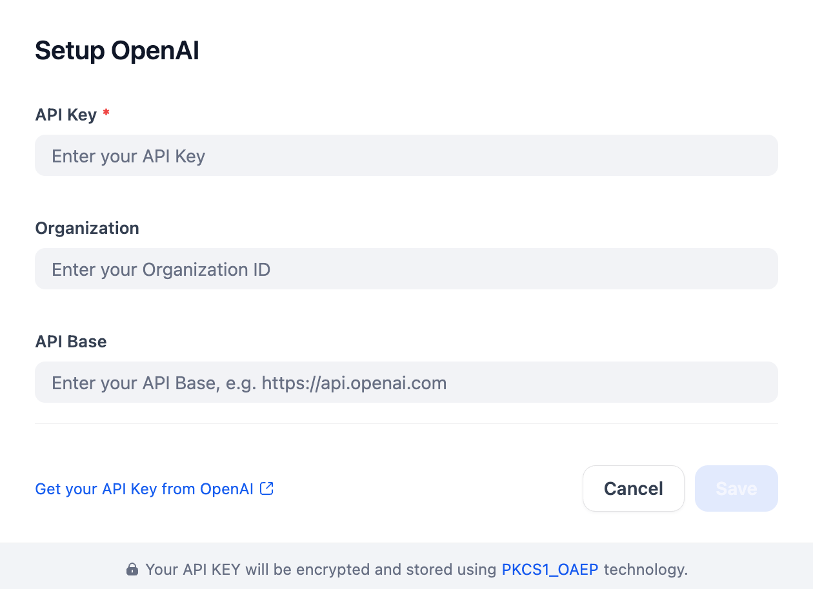

## Yuhe OpenAI
`yuhe-openai` is a maintained fork of the upstream OpenAI Dify plugin for OpenAI-compatible gateways that proxy the Responses API through stricter upstream implementations.

It keeps the OpenAI model coverage and provider schema, but adjusts the request transformation layer so GPT-5 / Responses API models work against gateways that reject some otherwise-public fields.

## Why This Fork Exists
This fork was created to maintain compatibility with Yuhe-style OpenAI-compatible gateways where `/v1/responses` can fail with upstream `502` errors when incompatible fields are forwarded.

The maintained changes include:

- stripping `metadata` from Responses API requests
- stripping `presence_penalty` and `frequency_penalty` for stricter Responses-compatible gateways
- converting system prompts from `role="system"` to `role="developer"` for gateways that reject `system` on `/v1/responses`
- keeping credential validation and runtime invocation behavior aligned for GPT-5-class models
- narrowing GPT-5-family parameter rules so unsupported fields are not exposed in the model parameter UI

## Overview
OpenAI offers a comprehensive set of models for various tasks, including text generation, image generation, vision, audio generation, text-to-speech (TTS), speech-to-text (STT), embeddings, moderation, and reasoning.

This plugin allows developers to integrate LLMs such as GPT-3.5, GPT-4, GPT-5, and the o1 family (including custom fine-tuned versions) via the API, with support for function calling.

## Configure
After installing the plugin, configure your OpenAI-compatible settings in the Model Provider section. This includes your API key (find it [here](https://platform.openai.com/account/api-keys)) and optional Organization ID and API Base. Save to use Yuhe OpenAI.

